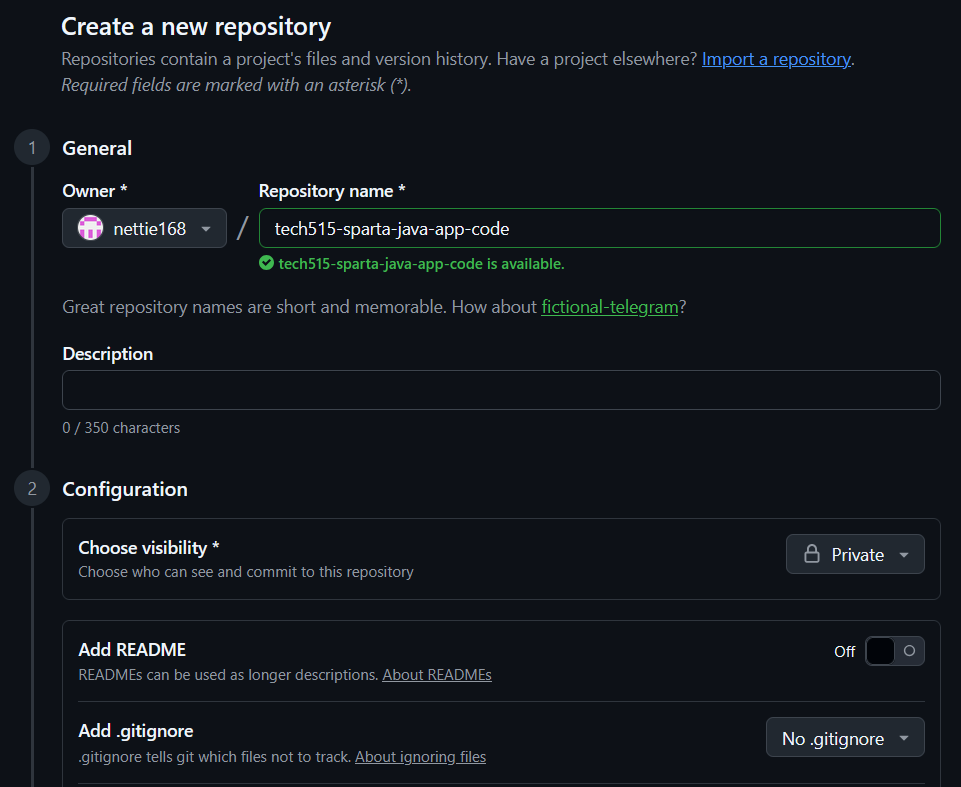

# How to create private GitHub repo
## For the storage of the app code and SQL script to seed the database

1. Download zip file from Teams
2. Extract zip file into empty directory `tech515-sparta-java-app-code`
3. Check for a .gitignore to ensure no credentials or sensitive information is tracked
   - (confirmed in LibraryProject2/)
4. Now we can safely initialise the repo (as our .gitignore has all files to be ignored), so cd into the directory and `git init` 
5. Rename branch `git branch -M master main`
6. Create a private remote GitHub repo of the same name
    
7. Back in the terminal, in the code directory 
   `git remote add origin https://github.com/nettie168/tech515-sparta-java-app-code.git`
9. Push to remote
    ```bash
    git add .
    git commit -m "first commit"
    git push -u origin main
    ```