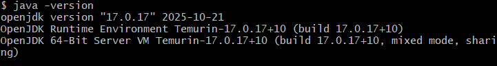
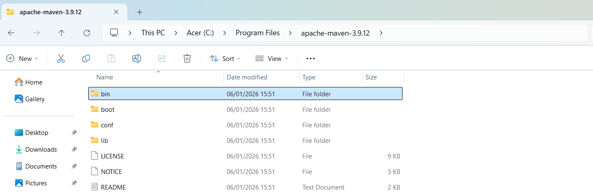
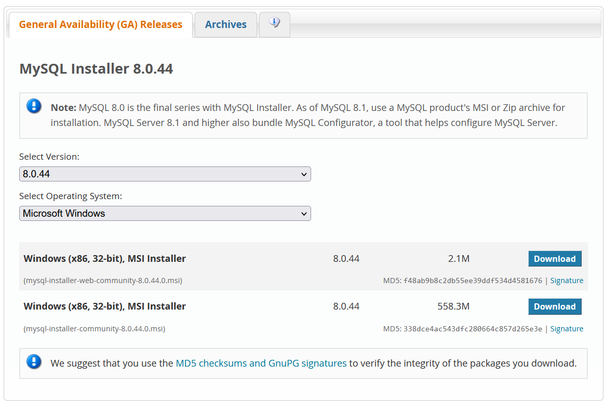
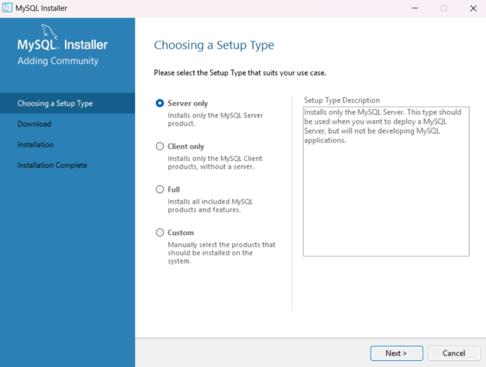
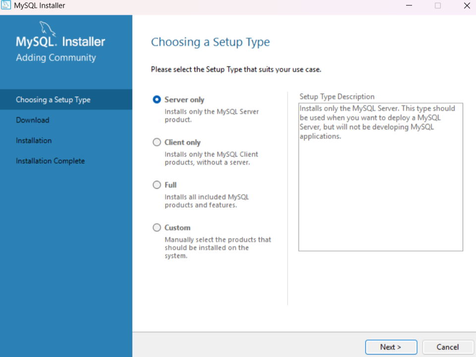
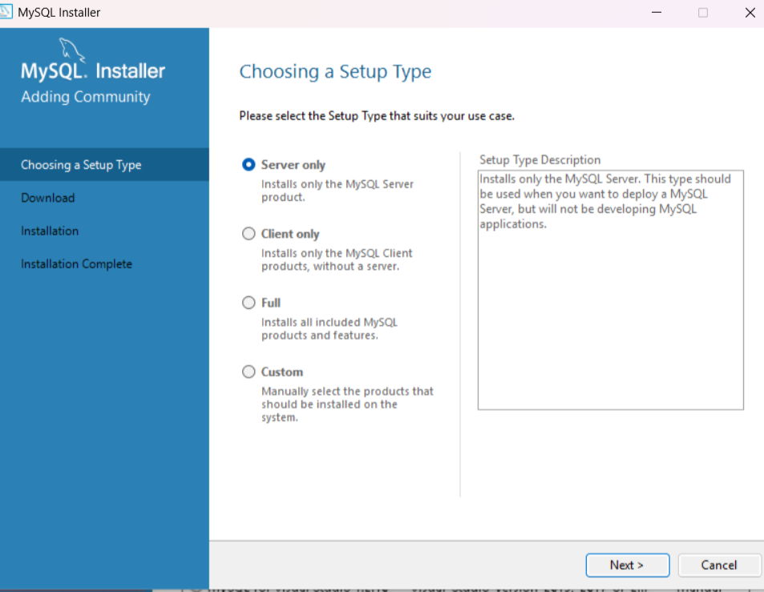
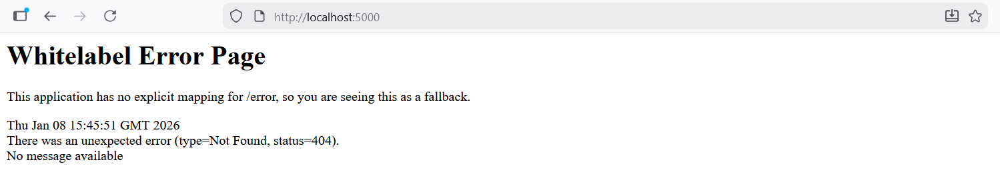
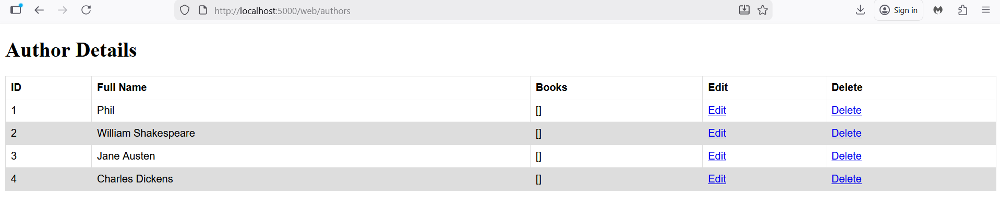
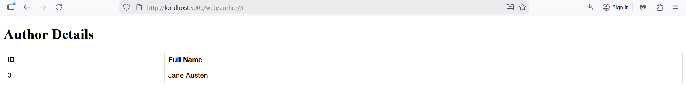

# How to Deploy the Sparta Spring Boot Java App locally

- [How to Deploy the Sparta Spring Boot Java App locally](#how-to-deploy-the-sparta-spring-boot-java-app-locally)
  - [General Method for Java Spring Boot app Deployment with SQL DB](#general-method-for-java-spring-boot-app-deployment-with-sql-db)
  - [Steps for manually deploying a Java Spring Boot app with SQL DB on a Windows machine](#steps-for-manually-deploying-a-java-spring-boot-app-with-sql-db-on-a-windows-machine)
  - [1. Install Java](#1-install-java)
  - [2. Install Maven](#2-install-maven)
  - [3. Install MySQL](#3-install-mysql)
  - [4. Set MySQL path](#4-set-mysql-path)
  - [5. Seed the database](#5-seed-the-database)
  - [6. Connect app to db (app to know location of database (and have access))](#6-connect-app-to-db-app-to-know-location-of-database-and-have-access)
    - [1. Add the .env to .gitignore](#1-add-the-env-to-gitignore)
    - [2. Add the environment variables to .env](#2-add-the-environment-variables-to-env)
  - [7. Start app](#7-start-app)
  - [Extra info on MySQL through Linux](#extra-info-on-mysql-through-linux)
      - [How to Connect \& Secure MySQL](#how-to-connect--secure-mysql)


## General Method for Java Spring Boot app Deployment with SQL DB

To Run the app 7 stages are needed:

1. Java installed
2. Maven installed (with version compatible with java version)
3. MySQL installed
4. MySQL Path set and running
5. Database created
6. App connected to db 
   - app to know location of database (and have access)
7. App started

## Steps for manually deploying a Java Spring Boot app with SQL DB on a Windows machine

For doing this manually and on a local Windows machine:

1. Install Java
   - with winget in the PowerShell
2. Install Maven
   - by downloading and executing an executable
   - and adding the PATH to the system environment variables
2. Install MySQL
   - by downloading and executing an executable
3. MySQL Path set and checked to be running
    - by adding the PATH to the system environment variables
    - and running `mysql -u username -p`
4. Database seeded
   - with `library.sql` file using `mysql -u root < library.sql`
5. Connect app to db 
   - set the environment variables
6. Start app

## 1. Install Java

Open a Windows PowerShell, by putting `Windows PowerShell` in the taskbar. You can also use a git bash shell. 

Check if Java is already installed
`java -version`

If not install JDK 17:

`winget install EclipseAdoptium.Temurin.17.JDK`

In a new terminal check java is installed
`java -version`. You should get the response (or similar to):




## 2. Install Maven

Check if maven already installed
`maven -version`

If not go to the Apache Maven Website and Download the Binary zip version.


When it is downloaded, go to the project folder and Extract to Program Files instead of in dowloads by selecting the Program Files



Step 2: Add MAVEN_HOME System Variable

1. Open the Start menu and search for environment variables.

2. Click the Edit the system environment variables result.

Select the Path, click `Edit` and then  `New`. Copy and paste in the path `%MAVEN_HOME%\bin ` then click ok on all windows.


In a new terminal window you can now check if mvn path is set with:

`mvn -version`


For more information on how to install maven see [install maven windows](https://phoenixnap.com/kb/install-maven-windows)

## 3. Install MySQL

https://dev.mysql.com/downloads/installer/


Install the first one

Then click


Click on the download to execute it



Select full

Click `Next` and `Execute`


When it has downloaded click `Next`



Then `Next`


Authentication Method

create a user with password
...

Then `Next`
Then `Execute`



**Reinstalling/Changing MySQL**

If the set up was wrong, and you want to reinstall it with different parameters then you will need to uninstall MySQL completely. There is also a way of going back into the installation and changing it, which can be more time effectice

**Uninstalling MySQL**

- Stop mysql in the task manager
- Delete the MySQL folder in Program Files
- Delete MySQL in ProgramData folder
- Remove the registry keys: Open the Registry Editor (by typing "regedit" in the Start menu search bar) and navigate to "HKEY_LOCAL_MACHINE\SOFTWARE\MySQL AB" and delete the "MySQL Server 8.0" key
- Restart machine
- For more information see: [how to uninstall mysql completely](https://learn.microsoft.com/en-us/answers/questions/4288035/how-to-uninstall-mysql-completely-from-my-system)

## 4. Set MySQL path

Go to Edit System environment variables (in search bar)
In System Variables find the Path > Click Edit
In Path click `New`
Copy and paste the path from windows explorer of the MySQL/bin should be:
`C:\Program Files\MySQL\MySQL Server 8.0\bin`

>**Note**: Make sure you get the Server path, and not the Shell or any other

Press `Ok` and `Ok` to close both windows

Open up a new git bash

Check that MySQL has been installed and that you can access it

`mysql -u root -p`

(The -u is for username, here we're using root as we haven't set up any users, and p is for password MySQL is password protected)

Then type in the password used to secure the MySQL

> **Note**: The recommended practice is to create a user with a secure password - changing it regularly for better security, but as this is just for testing/learning it's ok to use root here

## 5. Seed the database

Now the MySQL is created there is the framework for creating MySQL databases, but so far we have not made a database.

There are a number of ways to do this, but our app includes a library.sql file

Go to the repo location where the library.sql is located and run 

`mysql -u root -p < library.sql`


## 6. Connect app to db (app to know location of database (and have access))

In     tech515-sparta-java-app-code/LibraryProject2/src/main/resources/application.properties
```
spring.jpa.show-sql=true
spring.datasource.url=${DB_HOST}
spring.datasource.username=${DB_USER}
spring.datasource.password=${DB_PASS}
server.port=5000
spring.jpa.hibernate.ddl-auto=update
```

Environment variables for the DB_HOST (the location of the SQL DB), DB_USER (the username securing the DB) and DB_PASS (the corresponding password securing the DB) are needed.

These can feasibly be done in the command line, however putting passwords in the command line is a security risk if someone sees your screen.

As a result, it is safer to put them in a .env file.

### 1. Add the .env to .gitignore

It is best to start with securing the file, so that they are never made accessible by sharing them on gitHub

### 2. Add the environment variables to .env

Check if there isn't a .env already with `ls`, then if not create one.

Then add in:

`export DB_HOST = jdbc:mysql://localhost:3306/library`

`export DB_USER=root`

`export DB_PASS=PasswordUsed`

Then in the `LibraryProject2/src/main/resources/application.properties`
add at the top
`spring.config.import=optional:file:.env` so that it can find the .env file 


## 7. Start app

cd into `tech515-sparta-java-app-code/LibraryProject2`

Run app with:

`mvn spring-boot:run`

The app should hang, when the server is running (if the command line comes back, then something has failed and you need to scroll back through to see what failed - or you can print it to an output and read/grep that `mvn spring-boot:run > log`)

When you go to:

`http://localhost:5000`

result is:



And for `http://localhost:5000/web/authors`



And for `http://localhost:5000/web/author/3`




## Extra info on MySQL through Linux

When you install MySQL on Ubuntu, the default username is root, but it often has no password initially or uses the auth_socket plugin, meaning you log in with sudo mysql without typing a password. The password is set during the mysql_secure_installation script, where you create a strong password for the root user and remove anonymous users for security, so there isn't a fixed, pre-set password you need to know. 

Default Login (After Initial Install):
- Username: root
- Password: Often blank (press Enter), or relies on your system user via auth_socket. 

#### How to Connect & Secure MySQL

When you first connect to mysql you don't require a password
- bash `sudo mysql` This uses your Ubuntu user's privileges to log into MySQL as the root user. `exit;` to exit
- shows you can log into mysql without a password (security risk)
  
  Run Security Script:
- bash `sudo mysql_secure_installation` (sudo uses your Ubuntu user's privileges to log into MySQL as the root user )
  This script will prompt you to:
  1. Ask if you want to enable secure passwords (Check & inform user on how secure their password is and only allow secure passwords to be set) - choose yes 
  2. What level of secure of secure passwords are allowed; low, medium or high?
  3. Inform you that root user is not password protected, as it uses auth_socket by default, and that you can change this ALTER _USER
  4. anonymous users
```
By default, a MySQL installation has an anonymous user,
allowing anyone to log into MySQL without having to have
a user account created for them. This is intended only for
testing, and to make the installation go a bit smoother.
You should remove them before moving into a production
environment.
```
1. Only allow root from localhost

```
Normally, root should only be allowed to connect from
'localhost'. This ensures that someone cannot guess at
the root password from the network.
```
6. Remove test db
7. Reload privilige tables


```
sudo mysql_secure_installation

Securing the MySQL server deployment.

Connecting to MySQL using a blank password.

VALIDATE PASSWORD COMPONENT can be used to test passwords
and improve security. It checks the strength of password
and allows the users to set only those passwords which are
secure enough. Would you like to setup VALIDATE PASSWORD component?

Press y|Y for Yes, any other key for No: y

There are three levels of password validation policy:

LOW    Length >= 8
MEDIUM Length >= 8, numeric, mixed case, and special characters
STRONG Length >= 8, numeric, mixed case, special characters and dictionary                  file

Please enter 0 = LOW, 1 = MEDIUM and 2 = STRONG: 0

Skipping password set for root as authentication with auth_socket is used by default.
If you would like to use password authentication instead, this can be done with the "ALTER_USER" command.
See https://dev.mysql.com/doc/refman/8.0/en/alter-user.html#alter-user-password-management for more information.

By default, a MySQL installation has an anonymous user,
allowing anyone to log into MySQL without having to have
a user account created for them. This is intended only for
testing, and to make the installation go a bit smoother.
You should remove them before moving into a production
environment.

Remove anonymous users? (Press y|Y for Yes, any other key for No) : n

 ... skipping.


Normally, root should only be allowed to connect from
'localhost'. This ensures that someone cannot guess at
the root password from the network.

Disallow root login remotely? (Press y|Y for Yes, any other key for No) : y
Success.

By default, MySQL comes with a database named 'test' that
anyone can access. This is also intended only for testing,
and should be removed before moving into a production
environment.


Remove test database and access to it? (Press y|Y for Yes, any other key for No) : y
 - Dropping test database...
Success.

 - Removing privileges on test database...
Success.

Reloading the privilege tables will ensure that all changes
made so far will take effect immediately.

Reload privilege tables now? (Press y|Y for Yes, any other key for No) : y
Success.

All done!


- Set a strong password for the MySQL root user.
- Remove anonymous users.
- Disallow remote root login.
- Remove the test database.
Connect (With Your New Password):
- bash `mysql -u root -p`
You'll then enter the new password you set in the security script. 
> **Key Takeaway:** Don't expect a default password like 'password' or 'root'; instead, run the security script to set one up for your root user. 
```