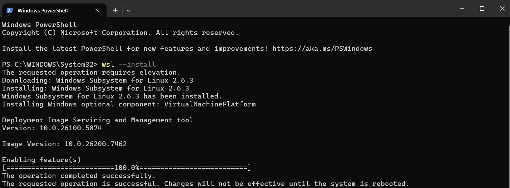
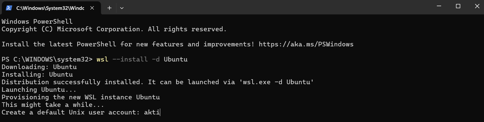
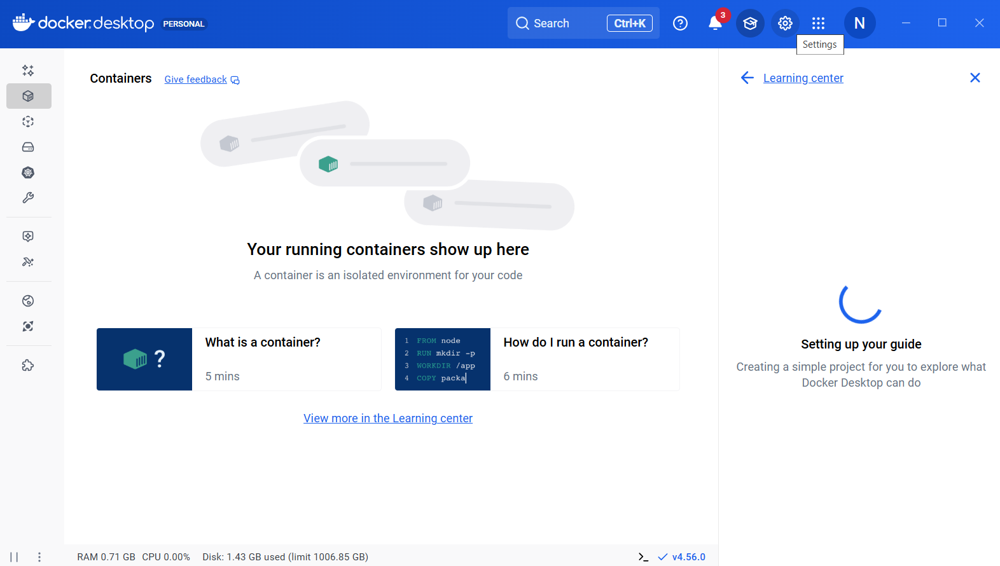
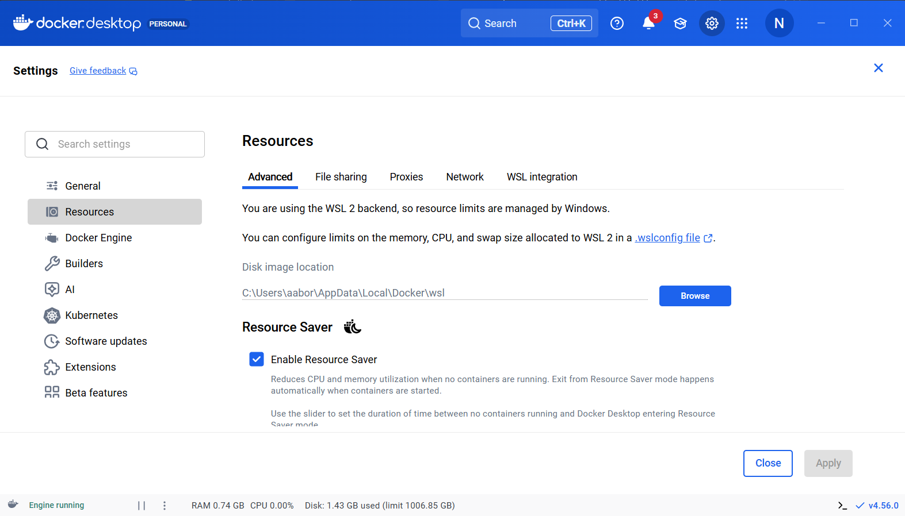
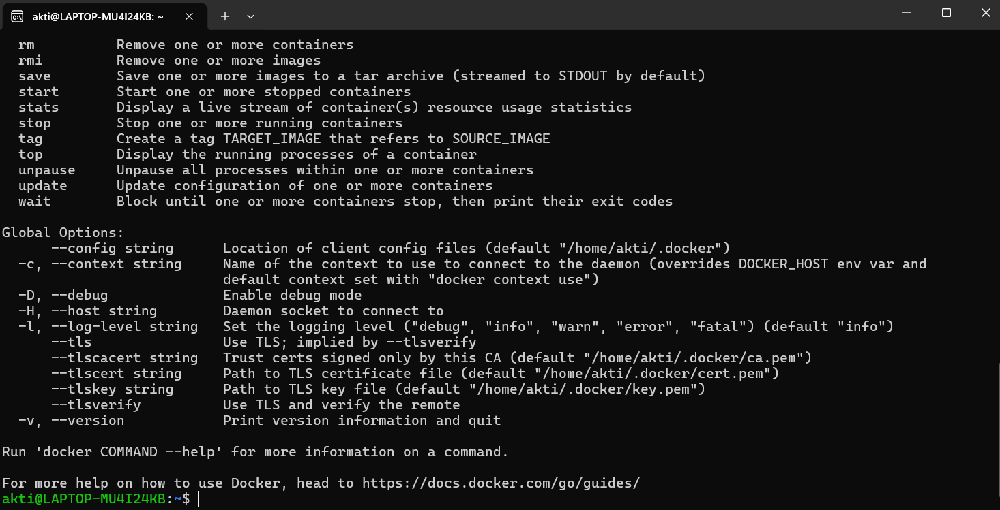

# Installing Docker locally on Windows

- [Docker Research](#docker-research)
      - [Difference between VM and Container?](#difference-between-vm-and-container)
    - [DockerHub](#dockerhub)
- [Installing Docker locally on Windows](#installing-docker-locally-on-windows)
  - [1. Create a DockerHub account](#1-create-a-dockerhub-account)
  - [2. Install wsl](#2-install-wsl)
  - [3. Reboot Machine](#3-reboot-machine)
  - [4. Set username and password for ubuntu?](#4-set-username-and-password-for-ubuntu)
  - [5. Download Docker Desktop](#5-download-docker-desktop)
  - [6. Execute the executable](#6-execute-the-executable)
  - [7. Computer restarts (again) 💥](#7-computer-restarts-again-)
  - [8. Accept the ToC?](#8-accept-the-toc)
  - [9. Log into Docker](#9-log-into-docker)
  - [10. Ensure that WSL Integration is Enabled](#10-ensure-that-wsl-integration-is-enabled)
  - [11. Last step: Check that Docker is working!](#11-last-step-check-that-docker-is-working)

11 steps to get Docker up and running on a native Windows machine (eg. a laptop or PC):
1. Create a DockerHub account
2. Install wsl
3. Reboot Machine
4. Set username and password for ubuntu?
5. Download Docker Desktop
6. Execute the executable
7. Computer restarts (again) 💥
8. Accept the ToC?
9. Log into Docker
10. Ensure that WSL Integration is Enable
11. Last step: Check that Docker is working!

## 1. Create a DockerHub account
https://hub.docker.com/signup

DockerHub is a remote repository of Docker imagges, you use it to pull other people's images, or push and pull your own. Very much like GitHub.

Once you have created an account it will send you an email to verify your email address. You will need to verify your email address before Docker allows you to log in (last stage 10?)

## 2. Install wsl

First you need to install wsl...as it...

In a PowerShell run `wsl --install`

## 3. Reboot Machine

After the installation, reboot your machine.

After the reboot, Windows will auto-launch your new Ubuntu OS and 

If Ubuntu doesn't launch when your computer is restarted, then open the PowerShell and put
`wsl --install -d Ubuntu`

## 4. Set username and password for ubuntu?
You will then be asked to set a username and password for your Ubuntu package??

## 5. Download Docker Desktop

https://docs.docker.com/desktop/setup/install/windows-install/

Go to ... and click `Download ...`

This will download an executable file

## 6. Execute the executable

This program will make changes to your machine - click yes

Then it will want you to confirm to create desktop... click ok

Docker will start the installation

## 7. Computer restarts (again) 💥

Once it has downloaded, click Ok and it will restart your computer automatically.

## 8. Accept the ToC

When it reboots it will automatically will pop up to accept the terms of service (Click Accept)
If it doesn't, then go to the Desktop icon and double click and it should come up

Docker will then open up

> It might give you an error message about WSL integration but you can skip it and set it up manually in the Docker app in the next steps

## 9. Log into Docker with your DockerHub username

This will take you to the browser to authenticate, put in your DockerHub details then it'll send you back to the app

## 10. Ensure that WSL Integration is Enabled

In Docker Desktop, click the Settings Gear icon. Then choose Resources, and finally WSL Integration. Make sure that the Enable Integration with my default WSL distro is checked. 

Go to WSL Integration Tab and switch on Ubuntu. Then `apply and restart` (thankfully only needs to restart Docker not you're whole machine). Then click `Close`

## 11. Last step: Check that Docker is working!

Open your Ubuntu distro 

Run `docker` and you should see:

Then log in using your DockerHub details `docker login`

Should see:

Go to `https://login.docker.com/activate` and put in your code

When you confirm your code you should get:

Back in the terminal if you get an "authentication didn't work" then go to your emails and verify your email address

Now `docker login` will be successful!

And voila! ✅ You have successfully downloaded Docker in Windows! Go you! 🥳