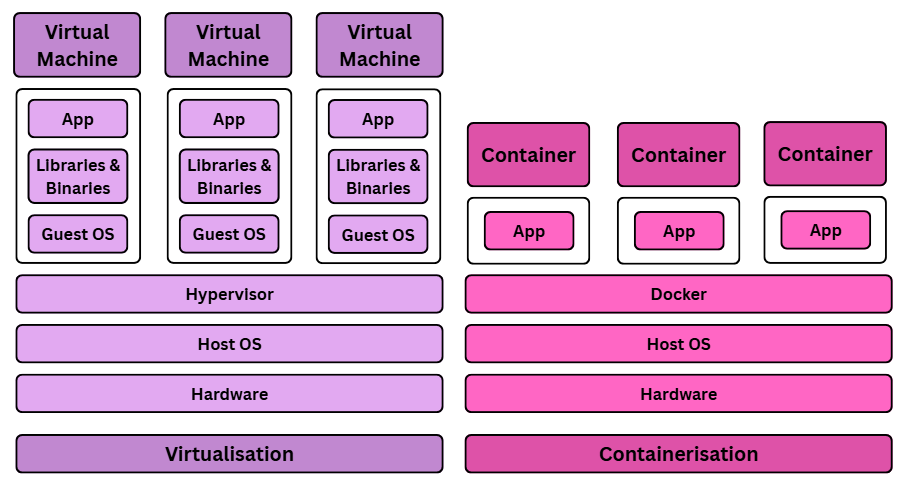
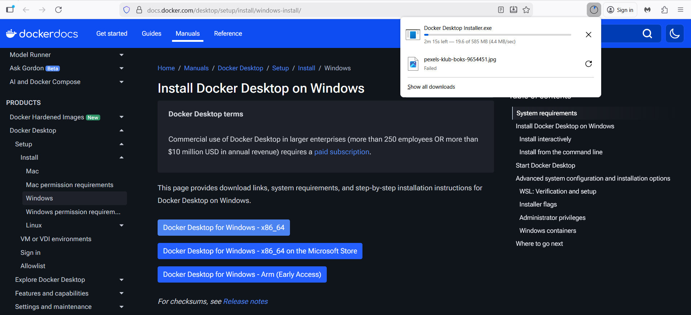
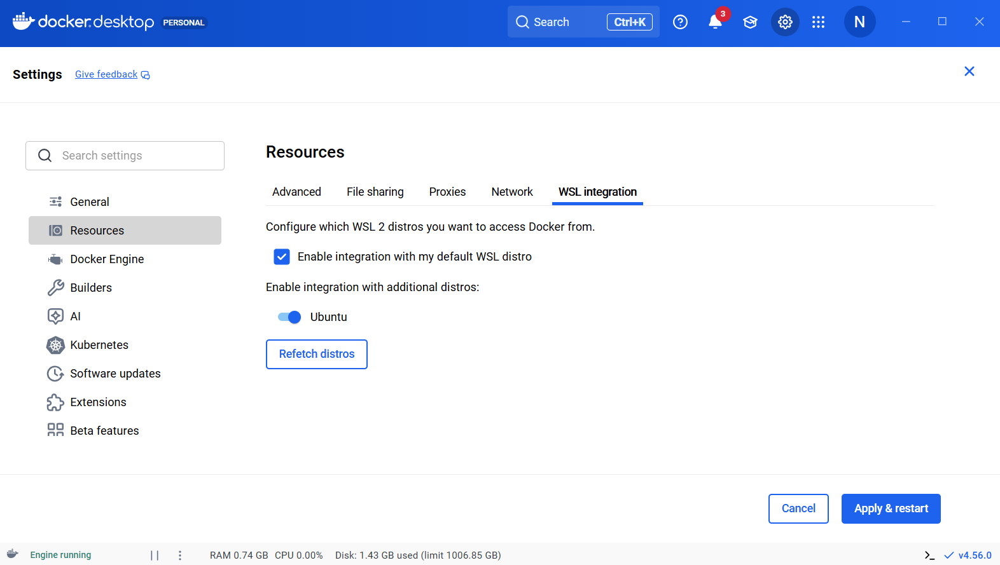
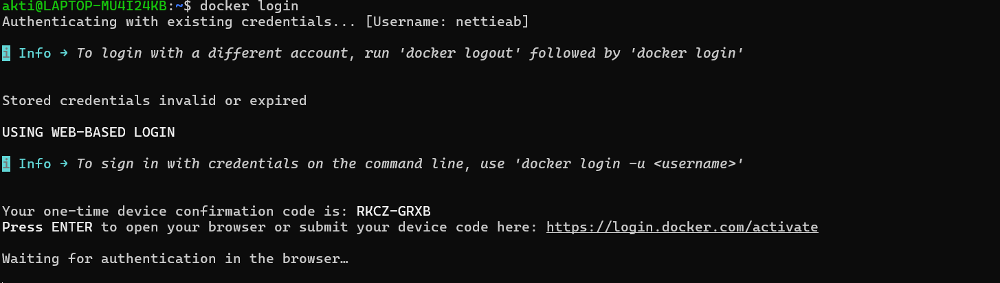
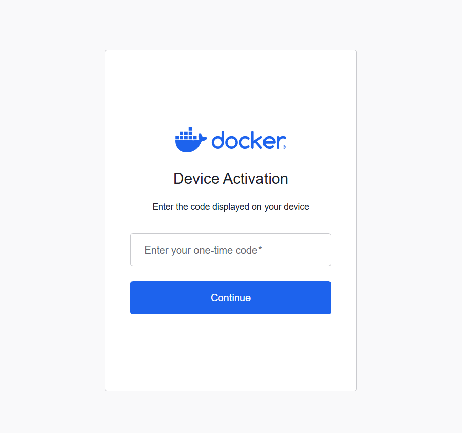
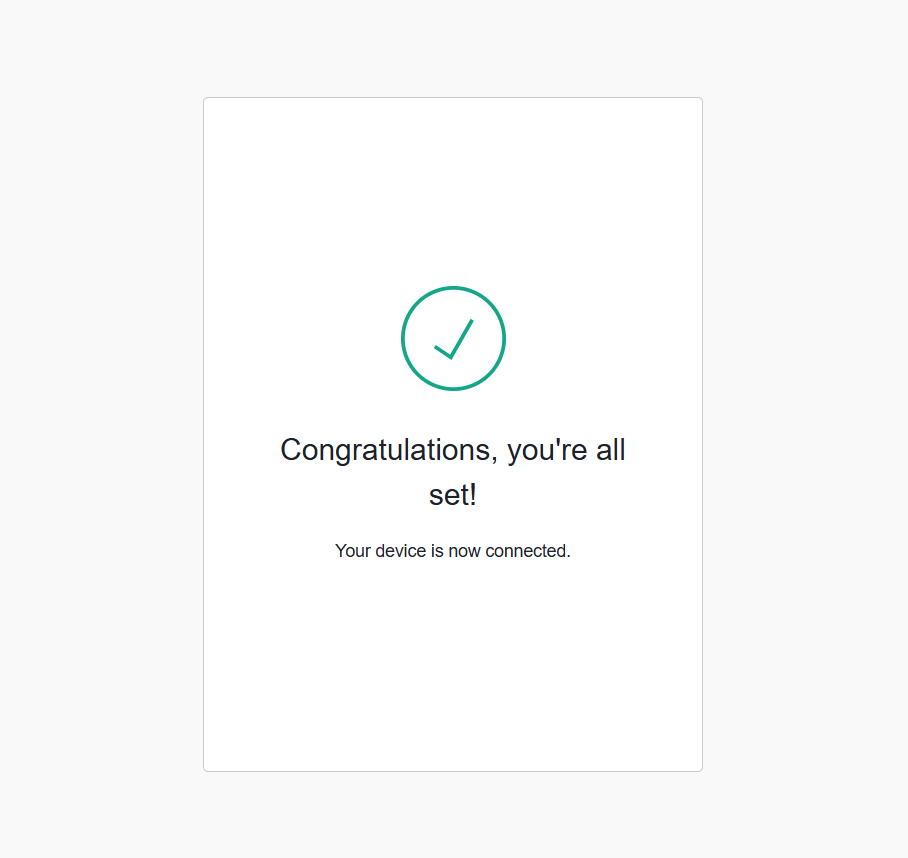
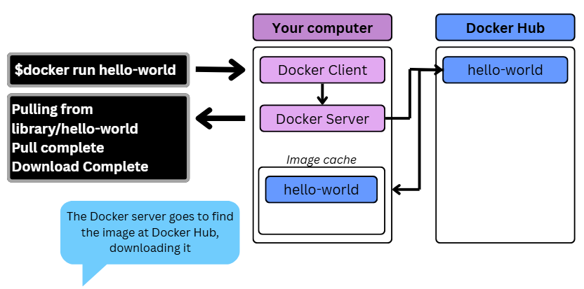
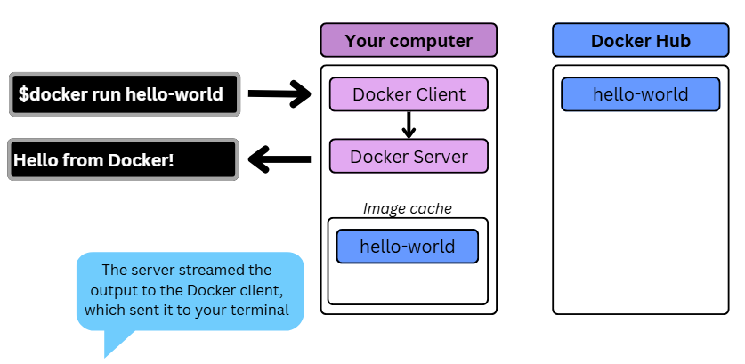
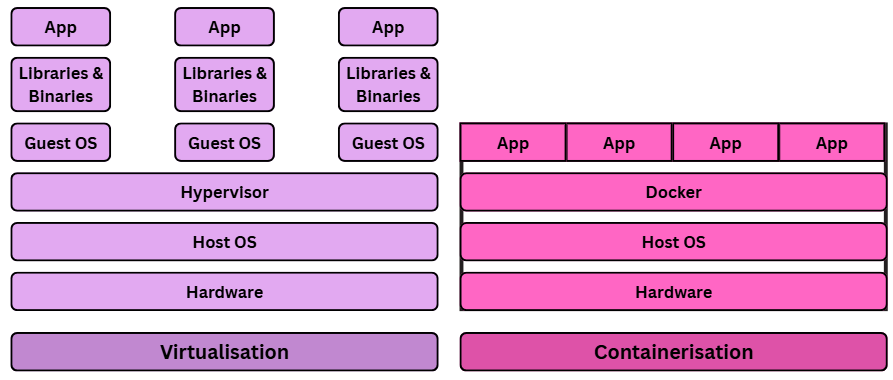

- [What is Docker?](#what-is-docker)
    - [Docker's Ecosystem?](#dockers-ecosystem)
    - [Benefits of Docker (Why do we use it?)](#benefits-of-docker-why-do-we-use-it)
    - [Docker Images and Containers](#docker-images-and-containers)
      - [Difference between VM and Container?](#difference-between-vm-and-container)
    - [DockerHub?](#dockerhub)
- [Installing Docker locally on Windows](#installing-docker-locally-on-windows)
  - [1. Create a DockerHub account](#1-create-a-dockerhub-account)
  - [2. Install wsl](#2-install-wsl)
  - [3. Reboot Machine](#3-reboot-machine)
  - [4. Set username and password for ubuntu?](#4-set-username-and-password-for-ubuntu)
  - [5. Download Docker Desktop](#5-download-docker-desktop)
  - [6. Execute the executable](#6-execute-the-executable)
  - [7. Computer restarts (again) 💥](#7-computer-restarts-again-)
  - [8. Accept the ToC?](#8-accept-the-toc)
  - [9. Log into Docker](#9-log-into-docker)
  - [10. Ensure that WSL Integration is Enabled](#10-ensure-that-wsl-integration-is-enabled)
  - [11. Last step: Check that Docker is working!](#11-last-step-check-that-docker-is-working)
- [Using Docker CLI/Client?](#using-docker-cliclient)
  - [The 4 steps of running `docker run hello-world` for the first time](#the-4-steps-of-running-docker-run-hello-world-for-the-first-time)
    - [1. The Docker client contacted the Docker Daemon](#1-the-docker-client-contacted-the-docker-daemon)
    - [2. The Docker daemon pulled the hello-world image from Docker Hub](#2-the-docker-daemon-pulled-the-hello-world-image-from-docker-hub)
    - [3. The Docker daemon created a new container from that image which runs the executable](#3-the-docker-daemon-created-a-new-container-from-that-image-which-runs-the-executable)
    - [4. The Docker daemon streamed the output to the Docker client, which sent it to your terminal](#4-the-docker-daemon-streamed-the-output-to-the-docker-client-which-sent-it-to-your-terminal)
- [More on Docker](#more-on-docker)
  - [Differences between virtualisation and containerisation](#differences-between-virtualisation-and-containerisation)
    - [What is usually included in a container vs virtual machine?](#what-is-usually-included-in-a-container-vs-virtual-machine)
    - [enefits of each, especially a virtual machine over the traditional architecture](#enefits-of-each-especially-a-virtual-machine-over-the-traditional-architecture)
  - [Microservices](#microservices)
    - [What are they?](#what-are-they)
    - [How are they made possible?](#how-are-they-made-possible)
    - [Benefits](#benefits)
  - [Docker](#docker)
    - [What is it](#what-is-it)
    - [Alternatives](#alternatives)
    - [How it works (Docker architecture/API)](#how-it-works-docker-architectureapi)
    - [Success story using Docker](#success-story-using-docker)
  - [Docker Tasks](#docker-tasks)
    - [Task: Run and pull your first image](#task-run-and-pull-your-first-image)
    - [Task: Run nginx web server in a Docker container](#task-run-nginx-web-server-in-a-docker-container)
    - [Task: Remove a container](#task-remove-a-container)
    - [Task: Modify our nginx default page in our running container](#task-modify-our-nginx-default-page-in-our-running-container)
    - [Task: Run a different container on different port](#task-run-a-different-container-on-different-port)
    - [Task: Push host-custom-static-webpage container image to Docker Hub](#task-push-host-custom-static-webpage-container-image-to-docker-hub)
    - [Task: Automate docker image creation using a Dockerfile](#task-automate-docker-image-creation-using-a-dockerfile)
  - [Project](#project)
    - [Task: Run Sparta test app in a container (locally?)](#task-run-sparta-test-app-in-a-container-locally)


# What is Docker?

A Docker is a suite of software/platform that can create and run containers, using images (See more on this later in [Docker Images and Containers](#docker-images-and-containers))


### Docker's Ecosystem?
Within Docker's ecosystem are multiple ... that can all work in during ways.

- **Docker Client** - A tool used to issue commands, which can interact with Docker Server behind the scenes
- **Docker Server** - creates images and runs containers


### Benefits of Docker (Why do we use it?)

Docker has many benefits

Eg. Software installation
   - Instead of trying to install something and deal with errors from dependencies and extensive troubleshooting during installation, Docker just does it.
   - Docker can install software, dealing with all dependences -> reducing the time it takes for installation and your sanity in trouble-shooting installation issues.


### Docker Images and Containers
```
                                             _______________
                                            |               |
                               /-------->   |   Container   |
                              /             |_______________|
     ___________             /               _______________    
    |           |           /               |               |
    |   Image   |----------------------->   |   Container   |
    |___________|           \               |_______________|
                             \               _______________
                              \             |               |
                               \-------->   |   Container   |
                                            |_______________|
```
_full-screen to see image_


An **image** is a single file containing all the dependencies and configuration to run a programme

> How is an EC2 AMI image different to a Docker image?
> ...

A **container** is an independent section of a machine with its own networking ....


#### Difference between VM and Container?

https://www.geeksforgeeks.org/system-design/virtualization-vs-containerization/

Docker is lighter weight and is better used on native hardware eg. on prem

(Can Docker be used on Virtual Machines?)



### DockerHub? 

# Installing Docker locally on Windows

## 1. Create a DockerHub account

https://hub.docker.com/signup

DockerHub is..., you use it to...

Once you have created an account it will sen dyou an email to verify your email address. You will need to verify your email address before Docker allows you to log in (last stage 10?)

## 2. Install wsl

First you need to install wsl...as it...

In a PowerShell run `wsl --install`


## 3. Reboot Machine
After the installation, reboot your machine.

After the reboot, Windows will auto-launch your new Ubuntu OS and 

If Ubuntu doesn't launch when your computer is restarted, then open the PowerShell and put
`wsl --install -d Ubuntu`

## 4. Set username and password for ubuntu?
You will then be asked to set a username and password for your Ubuntu package??


## 5. Download Docker Desktop

https://docs.docker.com/desktop/setup/install/windows-install/

Go to ... and click `Download ...`



This will download an executable file

## 6. Execute the executable

This program will make changes to your machine - click yes

Then it will want you to confirm to create desktop... click ok

Docker will start the installation

## 7. Computer restarts (again) 💥

Once it has downloaded, click Ok and it will restart your computer automatically.

## 8. Accept the ToC?

When it reboots it will automatically will pop up to accept the terms of service (Click Accept)
If it doesn't, then go to the Desktop icon and double click and it should come up

Docker will then open up

> It might give you an error message about WSL integration but you can skip it and set it up manually in the Docker app in the next steps

## 9. Log into Docker

with your DockerHub username

This will take you to the browser to authenticate, put in your DockerHub details then it'll send you back to the app

## 10. Ensure that WSL Integration is Enabled

In Docker Desktop, click the Settings Gear icon. Then choose Resources, and finally WSL Integration. Make sure that the Enable Integration with my default WSL distro is checked. 


Go to WSL Integration Tab and switch on Ubuntu. Then `apply and restart` (thankfully only needs to restart Docker not you're whole machine). Then click `Close`



## 11. Last step: Check that Docker is working!

Open your Ubuntu distro 


Run `docker` and you should see:


Then log in using your DockerHub details `docker login`

Should see:


Go to `https://login.docker.com/activate` and put in your code



When you confirm your code you should get:


Back in the terminal? if you get an "authentication didn't work" then go to your emails and verify your email address

Now `docker login` will be successful!


And voila! ✅ You have successfully downloaded Docker in Windows! Go you! 🥳

# Using Docker CLI/Client?

So let's get cracking and get our first image `hello-world`

`hello-world` is a Docker image stored on DockerHub, which you now have access to with your DockerHub account that you logged into.

> **Note**: Images are in lower cases

To run an image you use the command `docker run`

So if you type into your Ubuntu terminal `docker run hello-world` you'll get the following text:


The `hello-world` image is built just to output the text
```
Hello from Docker!
This message shows that your installation appears to be working correctly
```
Along with 4 steps that explain how Docker works worked when you ran `docker run hello-world`

## The 4 steps of running `docker run hello-world` for the first time

### 1. The Docker client contacted the Docker Daemon
(also called Docker Server or Docker Engine?)

There it found that the image `hello-world` was not in its image cache, and sent back the message "Unable to find image 'hello-world':latest"


### 2. The Docker daemon pulled the hello-world image from Docker Hub



### 3. The Docker daemon created a new container from that image which runs the executable

> A container being an instance of an image, which run that one, specific programme

The executable programme in this case creates text "Hello from Docker!" and these 4 steps.


### 4. The Docker daemon streamed the output to the Docker client, which sent it to your terminal



This is what happens the first time as the image is not in the cache. The second time you run it it will do only steps 1, 3 and 4 because the `hello-world` image will already be in the image cache. So you will not see the message "Unable to find image 'hello-world':latest".

(How long is image "remembered" in cache?)


<br>
<hr>

# More on Docker

## Differences between virtualisation and containerisation

https://www.geeksforgeeks.org/system-design/virtualization-vs-containerization/



In Virtualization a Virtual Machine, like it's name, acts like its own machine but on a physical machine.

In Virtualization the hardware has it's own operating system (it's Host OS), on top of which is a Hypervisor (which does...), and on top of this are virtual machines each with their own distinct operating system, libraries and the apps operating in them.

Example on a local windows machine:
On a windows laptop, you can set up a virtual machine with a linux operating system.

The Windows machine still has it's Windows OS, but it allocates space on its hardware to create a "virtual machine" which has linux OS. Then you can use linux commands on a windows laptop, as the VM is distinct from the host.

Example in the public cloud:
AWS runs hardware with its own OS, then on top of that users can create their own virtual machines. So on one AWS machine could be running several VMS from different users, each with their own OS.

In Containerisation the containers are less distinct. Docker works on top of the host OS, creating distinct areas (in physical memory?). Each container is on the same host OS.

### What is usually included in a container vs virtual machine?


### enefits of each, especially a virtual machine over the traditional architecture

## Microservices

### What are they?

### How are they made possible?

### Benefits

## Docker

https://www.geeksforgeeks.org/devops/introduction-to-docker/

### What is it

### Alternatives

### How it works (Docker architecture/API)

### Success story using Docker

## Docker Tasks

### Task: Run and pull your first image

See ...

1. Open a Git Bash window (or terminal on Mac)

2. Get help from the docker command

3. Workout the docker command to show all Docker images you already have on your local machine, then run it

4. Run your first Docker container using the `hello-world` image

5. Re-run the command and notice the difference. Does the image need to be downloaded again when the command is run a second time? Document what happens when you run a docker image that does vs does not already exist on your local machine.

6. Well done, you’ve run your first Docker container. Document everything you’ve learnt


### Task: Run nginx web server in a Docker container

1. Open a Git Bash window (or terminal on Mac)

2. Download the latest nginx Docker image using a docker command

3. Run it so that it exposes it the running container on port 80 on your local machine

4. Run a Docker command to check if it’s running

5. Check it’s working by going to localhost or 127.0.0.1 in your web browser

6. Stop the container running

7. Well done, you’ve run the nginx web server in a Docker container on your local machine. Document everything you’ve learnt


### Task: Remove a container

1. Open a Git Bash window (or terminal on Mac)

2. Re-start the nginx container you were previously running

3. While the nginx container is running, try to remove the container –  take note of the error

4. Work out the switch/option that you need to use so that you can forcibly remove a container which running

5. Run the docker command to check whether the container is still there

6. Well done, you’ve learnt to remove a container even if the container is already running. Document everything you’ve learnt


### Task: Modify our nginx default page in our running container

1. Re-run the nginx container exposed on port 80 of your local machine

2. Check the default webpage of the container in your web browser and keep it open for later

3. Access the shell of the nginx container that is running

4. If you get an error, about “TTY”, work out how to run an `alias` command to make sure that every time you run the docker command it will be prefixed with `winpty`

5. Once you’ve logged into the shell of the nginx container, do an update & upgrade

6. Try to run `sudo` - notice the problem, then install sudo to fix it

7. Check your present working directory, then navigate to where the default nginx file is kept

8. Use nano to edit index.html – notice the problem, then fix it so you can use nano

9. Once nano works, modify the HTML of the file so that instead of “Welcome to nginx!” the home page will be “Welcome to the Tech xxx Dreamteam!” – save your changes

10. Check how the default web page in the browser has changed

11. Well done, you’ve learnt to modify a running container by logging into it and changing a file. Document everything you’ve learnt


### Task: Run a different container on different port

1. Carrying on from the last task, you should already have running the nginx container that you modified

2. Try to run another container exposed on port 80 on your local machine (connect to port 80 inside the container) – here is the endpoint for the image to use: `daraymonsta/nginx-257:dreamteam`

3. Document the error and why it occurs

4. Remove the container we tried to run but couldn’t

5. Try to run the container from step 2 again but this time expose it on your local machine on port 90. Check this container is running in your web browser at `localhost:90`


### Task: Push host-custom-static-webpage container image to Docker Hub

1. Create an image from your running container which is running nginx with the index.html file we already modified earlier

2. Push the image to your Docker Hub account

3. Use a docker command to run the container which uses your pushed container image. The container image referenced should contain your username on Docker Hub.


### Task: Automate docker image creation using a Dockerfile

Rationale: We don't want to do the steps manually to change the default nginx page. We want to automate it.

1. Create a new folder such as techxxx-mod-nginx-dockerfile (not in a repo that will be published)

2. `cd` into the new folder

3. Create an index.html you'd like to use instead of the nginx default page

4. Create a Dockerfile to:

1. Use the nginx base image

2. Copy your index.html to the location of the nginx default page in the container

5. Use a docker build command to build your custom image

   - Tag it similar to techxxx-nginx-auto:v1

6. Run the container

7. Push your custom image to Docker Hub

8. Use a docker command to run the container with uses your pushed custom image

9. Remove the local copy of your custom image

10. Re-run your container and force docker to pull the custom image from Docker Hub

## Project
### Task: Run Sparta test app in a container (locally?)

Aim: Run Node JS v20 Sparta test app in a Docker container (frontpage only)

Timing: 1 hour

1. Create a new folder for this task (because you can only have one Dockerfile per folder)

2. Put your 'app' folder in the that folder

3. Create a new Dockerfile

4. Steps for the Dockerfile:
```
# from which image


# label


# set the default working directory to /usr/src/app


# copy app folder (to same place as Dockerfile, then copy to default location in container)

# COPY app /usr/src/app

# COPY package*.json ./


# install dependencies with npm


# expose port


# CMD [node app.js or npm start]
```

5. You should be able to run three docker commands to get the app running at port 3000 (as well as get the container image which is build pushed to Docker Hub):

o docker build

o docker run

o docker push

6. Force docker to pull a fresh image from Docker Hub to re-run your own app image


Task: Research Docker Compose

· Why use it?

· How to use it

o What do you need to install for it to work?

o How to store your docker compose file?

o Find out about these docker compose commands to:

§ manage your application

§ start the application (without detached mode)

§ start the application (in detached mode)

§ what is the difference between running your application with or without detached mode

§ stop the application

§ run your application in detached mode

§ check services running with docker compose

§ view logs in real-time

§ view docker compose images


Task: Use Docker Compose to run app and database containers

· Do we have images we need?

o For the Node app, we have a microservice image

o For the Mongo database image, you will need to find the right version to use

· Because we have the database, we want to run multiple containers (2 services)

o The Mongo database container must be running already for the app to work

o For the app, we need to spin up a container, ssh into it, create env var

· Once app and database containers work (including a blank /posts page) work on how to seed the database:

o Manually (i.e. logging into the container and running the command), then

o Automatically (there are different methods for this - how many methods can you get working?)


Example of docker-compose.yaml (v2)
```
version: "2"

services:

#command: node app/seeds/seed.js
```

Note:

· You can use version 3 of Docker Compose

· Naming is case sensitive

· Create two services, one for Mongo database, one for the web app

· About the database service:

o The database will use a volume to persist Mongo DB data across container restarts

o ports "27017:27017"

o setup the bindIp? (check does this need to be done)

· About the web app service:

o Use the image you pushed to Docker Hub

o Link to mongo by setting the env var

· If you need run a command inside your docker container, use this command:

o docker exec -it <container-name> <cmd>

o Examples:

§ docker exec -it app node seeds/seed.js

§ docker exec -it mongo cat /etc/mongod.conf


Extension (if time):

· Run the containers on an EC2 instance