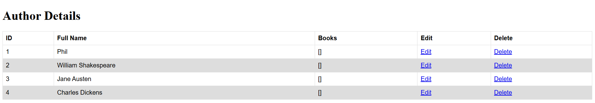

# Deploying Java app using Docker

A Docker is a suite of software/platform that can create and run containers, using images

- [Deploying Java app using Docker](#deploying-java-app-using-docker)
  - [1. Create Dockerfile](#1-create-dockerfile)
  - [2. Build image](#2-build-image)
  - [3. Create docker-compose.yml](#3-create-docker-composeyml)
  - [4. Run container to check images are correct](#4-run-container-to-check-images-are-correct)
  - [5. Push to Dockerhub](#5-push-to-dockerhub)
- [Automate deployment](#automate-deployment)
  - [On a fresh VM](#on-a-fresh-vm)
  - [On a VM using AMI with docker installed](#on-a-vm-using-ami-with-docker-installed)


Have an AMI with docker and app downloaded (or download Docker locally, and have app folder)
   - See [prov-app-docker.sh](./prov-app-docker.sh)

## 1. Create Dockerfile

In app root directory

```yml
# Use maven image
FROM maven:3.9.6-eclipse-temurin-17 AS build

# set the working directory as /app
WORKDIR /app

# copy the java-spring boot dependency file?? first
COPY LibraryProject2/pom.xml .

# run maven
RUN mvn dependency:go-offline

# copy the source file
COPY LibraryProject2/src ./src

# create the package??
RUN mvn clean package -DskipTests

# use java image
FROM eclipse-temurin:17-jre

# set the working directory as /app
WORKDIR /app

COPY --from=build /app/target/*.jar app.jar

# expose the port
EXPOSE 5000

# run the app.jar
ENTRYPOINT ["java","-jar","app.jar"]
```

## 2. Build image

Now docker can build the image from the Dockerfile

`docker build -t nettieab/sparta-library-app:latest`


## 3. Create docker-compose.yml

```yml
services:
  mysql:
    image: mysql:8.0
    container_name: mysql
    restart: always
    environment:
      MYSQL_ROOT_PASSWORD: rootpassword
      MYSQL_DATABASE: library
      MYSQL_USER: appuser
      MYSQL_PASSWORD: apppassword
    volumes:
      - mysql_data:/var/lib/mysql
      - ./library.sql:/docker-entrypoint-initdb.d/library.sql
    ports:
      - "3306:3306"

  app:
    image: sparta-library-app
    container_name: sparta-app
    restart: always
    depends_on:
      - mysql
    ports:
      - "5000:5000"
    environment:
      DB_HOST: jdbc:mysql://mysql:3306/library
      DB_PORT: 3306
      DB_USER: appuser
      DB_PASS: apppassword

volumes:
  mysql_data:
```

## 4. Run container to check images are correct

`docker compose up -d`

If you go to http://34.245.91.23:5000/web/authors

You should get:


And if you run:
`sudo docker compose ps`

You should get:


## 5. Push to Dockerhub

Have a Docker Hub account https://hub.docker.com/signup

`docker push nettieab/sparta-libraryapp`

# Automate deployment

## On a fresh VM

User data:
```sh
#!/bin/bash

# update libraries
sudo apt update

# upgrade libraries
sudo DEBIAN_FRONTEND=noninteractive apt upgrade -y

# install docker & docker compose
sudo DEBIAN_FRONTEND=noninteractive apt install -y apt-transport-https ca-certificates curl software-properties-common

curl -fsSL https://download.docker.com/linux/ubuntu/gpg | sudo gpg --dearmor -o /usr/share/keyrings/docker-archive-keyring.gpg

echo "deb [arch=amd64 signed-by=/usr/share/keyrings/docker-archive-keyring.gpg] https://download.docker.com/linux/ubuntu $(lsb_release -cs) stable" | sudo tee /etc/apt/sources.list.d/docker.list > /dev/null

sudo apt update && sudo apt DEBIAN_FRONTEND=noninteractive install -y docker-ce docker-ce-cli containerd.io

docker --version

# create library.sql
cat << 'EOF' > ~/library.sql
DROP DATABASE IF EXISTS library;
CREATE DATABASE library;

USE library;

CREATE TABLE authors (
author_id int PRIMARY KEY NOT NULL AUTO_INCREMENT,
full_name VARCHAR(40)
);
CREATE TABLE books (
book_id int  PRIMARY KEY NOT NULL AUTO_INCREMENT,
title VARCHAR(100),
author_id int,
FOREIGN KEY (author_id) REFERENCES authors(author_id)
);

INSERT INTO `library`.`authors` (`full_name`) VALUES ('Phil');
INSERT INTO `library`.`authors` (`full_name`) VALUES ('William Shakespeare');
INSERT INTO `library`.`authors` (`full_name`) VALUES ('Jane Austen');
INSERT INTO `library`.`authors` (`full_name`) VALUES ('Charles Dickens');
EOF

# EOF docker-compose file
cat << 'EOF' > ~/docker-compose.yml
services:
  mysql:
    image: mysql:8.0
    container_name: mysql
    restart: always
    environment:
      MYSQL_ROOT_PASSWORD: rootpassword
      MYSQL_DATABASE: library
      MYSQL_USER: appuser
      MYSQL_PASSWORD: apppassword
    volumes:
      - mysql_data:/var/lib/mysql
      - ./library.sql:/docker-entrypoint-initdb.d/library.sql
    ports:
      - "3306:3306"

  app:
    image: nettieab/sparta-library-app
    container_name: sparta-app
    restart: always
    depends_on:
      - mysql
    ports:
      - "5000:5000"
    environment:
      DB_HOST: jdbc:mysql://mysql:3306/library
      DB_PORT: 3306
      DB_USER: appuser
      DB_PASS: apppassword

volumes:
  mysql_data:
EOF

# run containers
docker-compose up
```

## On a VM using AMI with docker installed
User data:
```sh
#!/bin/bash

# create library.sql
cat << 'EOF' > ~/library.sql
DROP DATABASE IF EXISTS library;
CREATE DATABASE library;

USE library;

CREATE TABLE authors (
author_id int PRIMARY KEY NOT NULL AUTO_INCREMENT,
full_name VARCHAR(40)
);
CREATE TABLE books (
book_id int  PRIMARY KEY NOT NULL AUTO_INCREMENT,
title VARCHAR(100),
author_id int,
FOREIGN KEY (author_id) REFERENCES authors(author_id)
);

INSERT INTO `library`.`authors` (`full_name`) VALUES ('Phil');
INSERT INTO `library`.`authors` (`full_name`) VALUES ('William Shakespeare');
INSERT INTO `library`.`authors` (`full_name`) VALUES ('Jane Austen');
INSERT INTO `library`.`authors` (`full_name`) VALUES ('Charles Dickens');
EOF

# EOF docker-compose file
cat << 'EOF' > ~/docker-compose.yml
services:
  mysql:
    image: mysql:8.0
    container_name: mysql
    restart: always
    environment:
      MYSQL_ROOT_PASSWORD: rootpassword
      MYSQL_DATABASE: library
      MYSQL_USER: appuser
      MYSQL_PASSWORD: apppassword
    volumes:
      - mysql_data:/var/lib/mysql
      - ./library.sql:/docker-entrypoint-initdb.d/library.sql
    ports:
      - "3306:3306"

  app:
    image: nettieab/sparta-library-app
    container_name: sparta-app
    restart: always
    depends_on:
      - mysql
    ports:
      - "5000:5000"
    environment:
      DB_HOST: jdbc:mysql://mysql:3306/library
      DB_PORT: 3306
      DB_USER: appuser
      DB_PASS: apppassword

volumes:
  mysql_data:
EOF

# run containers
docker-compose up
```